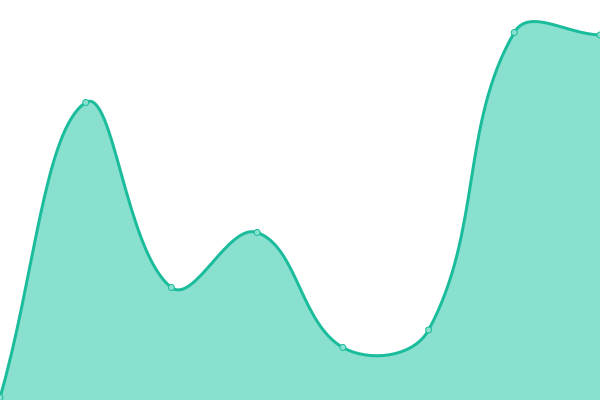
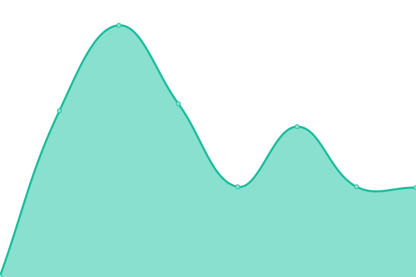

# [📈 Live Status](https://demo.upptime.js.org): <!--live status--> **🟩 All systems operational**

This repository contains the open-source uptime monitor and status page for [Baleshevich Srdjan](https://wp.me/2brNg), powered by [Upptime](https://github.com/upptime/upptime).

With [Upptime](https://upptime.js.org), you can get your own unlimited and free uptime monitor and status page, powered entirely by a GitHub repository. We use [Issues](https://github.com/BaleshSrle/upptime/issues) as incident reports, [Actions](https://github.com/BaleshSrle/upptime/actions) as uptime monitors, and [Pages](https://demo.upptime.js.org) for the status page.

<!--start: status pages-->
<!-- This summary is generated by Upptime (https://github.com/upptime/upptime) -->
<!-- Do not edit this manually, your changes will be overwritten -->
<!-- prettier-ignore -->
| URL | Status | History | Response Time | Uptime |
| --- | ------ | ------- | ------------- | ------ |
|  [Website](https://baleshsrle.github.io/) | 🟩 Up | [website.yml](https://github.com/BaleshSrle/upptime/commits/HEAD/history/website.yml) | 

 145ms
     
 | 

<a href="https://BaleshSrle.github.io/upptime/history/website">100.00%</a>
    

|  [Portfolio](https://baleshsrle.github.io/portfolio/) | 🟩 Up | [portfolio.yml](https://github.com/BaleshSrle/upptime/commits/HEAD/history/portfolio.yml) | 

 106ms
     
 | 

<a href="https://BaleshSrle.github.io/upptime/history/portfolio">100.00%</a>
    

|  [SFDobojWebAppCollection](https://baleshsrle.github.io/SFDobojWebAppCollection/) | 🟩 Up | [sf-doboj-web-app-collection.yml](https://github.com/BaleshSrle/upptime/commits/HEAD/history/sf-doboj-web-app-collection.yml) | 

 60ms
     
 | 

<a href="https://BaleshSrle.github.io/upptime/history/sf-doboj-web-app-collection">100.00%</a>
    

|  [jsDelivr CDN](https://cdn.jsdelivr.net/) | 🟩 Up | [js-delivr-cdn.yml](https://github.com/BaleshSrle/upptime/commits/HEAD/history/js-delivr-cdn.yml) | 

 207ms
     
 | 

<a href="https://BaleshSrle.github.io/upptime/history/js-delivr-cdn">99.71%</a>
    

|  [AdGuard DNS 1](94.140.14.14) | 🟩 Up | [ad-guard-dns-1.yml](https://github.com/BaleshSrle/upptime/commits/HEAD/history/ad-guard-dns-1.yml) | 

 200ms
     
 | 

<a href="https://BaleshSrle.github.io/upptime/history/ad-guard-dns-1">100.00%</a>
    

|  [AdGuard DNS 2](94.140.15.15) | 🟩 Up | [ad-guard-dns-2.yml](https://github.com/BaleshSrle/upptime/commits/HEAD/history/ad-guard-dns-2.yml) | 

 200ms
     
 | 

<a href="https://BaleshSrle.github.io/upptime/history/ad-guard-dns-2">100.00%</a>
    

<!--end: status pages-->

[**Visit our status website →**](https://demo.upptime.js.org)

## 📄 License

- Powered by: [Upptime](https://github.com/upptime/upptime)
- Code: [MIT](./LICENSE) © [Anand Chowdhary](https://anandchowdhary.com), supported by [Pabio](https://pabio.com)
- Data in the `./history` directory: [Open Database License](https://opendatacommons.org/licenses/odbl/1-0/)
